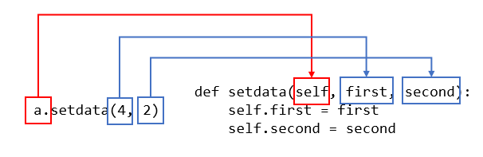

# Python Basic

---

[점프 투 파이썬](https://wikidocs.net/book/1)을 기반으로 작성

공부기간 2022-01-12 ~ 2022-01-14

디스코드 봇을 만들다보니 깔끔한 코드를 짜보고 싶어서 시작하게 됨

개념위주로 공부. 봇을 완성한 후 연습문제를 풀어볼 예정

공부해보니 깔끔한 코드가 굉장히 매력적인 언어라는 것을 생각함

---

# 자료형

## 숫자형 Number

### 정수형 Integer

> 양의 정수, 0, 음의 정수

```python
>>> a = 123
>>> a = -178
>>> a = 0
```

### 실수형 Floadting-point

> 소수점이 포함된 숫자

```python
>>> a = 1.2
>>> a = -3.45

# 실수형의 소수점 표현 방식
>>> a = 4.24E10
>>> a = 4.24e-10
```

### 8진수 Ocatal

> 0o 또는 0O(숫자0 + 알파벳 소문자 o 또는 대문자 O)로 시작

```python
>>> a = 0o177
```

### 16진수 Hexadecimal

> 0x로 시작

```python
>>> a = 0x8ff
>>> b = 0xABC
```

### 복소수 Complex

> j 또는 J 사용

```python
>>> a = 2 + 3j
>>> b = 3
>>> a * b
(6+9j)
```

### 숫자형을 활용하는 연산자

### 사칙연산

> +, - , \*, /

```python
>>> a = 3
>>> b = 4
>>> a + b
7
>>> a * b
12
>>> a / b
0.75
```

### 제곱

> ** x**y x의 y제곱

```python
>>> a = 3
>>> b = 4
>>> a ** b
81
```

### 나머지

> %

```python
>>> 7 % 3
1
>>> 3 % 7
3
```

### 몫

> //

```python
>>> 7 // 4
1
```

---

## 문자열 자료형 String

### 큰따옴표

> “abcd”

```python
"Hello World"
```

### 작은따옴표

> ‘abcd’

```python
'Python is fun'
```

### 큰따옴표 3개 연속

> “””abcd”””

```python
"""Life is too short, You need python"""
```

### 작은따옴표 3개 연속

> ‘’’abcd’’’

```python
'''Life is too short, You need python'''
```

### 문자열 안에 작은 따옴표나 큰따옴표를 포함시키고 싶을때

```python
# 서로 다른 따옴표 사용
# 같은 경우 SyntaxError 발생
>>> food = "Python's favorite food is perl"

#백슬래시 사용
>>> food = 'Python\'s favorite food is perl'
>>> say = "\"Python is very easy.\" he says."
```

### **여러 줄인 문자열을 변수에 대입하고 싶을 때**

```python
#이스케이프 코드 사용
코드	설명
\n	문자열 안에서 줄을 바꿀 때 사용
\t	문자열 사이에 탭 간격을 줄 때 사용
\\	문자 \를 그대로 표현할 때 사용
\'	작은따옴표(')를 그대로 표현할 때 사용
\"	큰따옴표(")를 그대로 표현할 때 사용
\r	캐리지 리턴(줄 바꿈 문자, 현재 커서를 가장 앞으로 이동)
\f	폼 피드(줄 바꿈 문자, 현재 커서를 다음 줄로 이동)
\a	벨 소리(출력할 때 PC 스피커에서 '삑' 소리가 난다)
\b	백 스페이스
\000	널 문자

#큰따옴표 또는 작은따옴표 3개사용

>>> multiline='''
... Life is too short
... You need python
... '''

>>> multiline="""
... Life is too short
... You need python
... """
```

### **문자열 연산하기**

```python
#문자열 더해서 연결하기(Concatenation)
>>> head = "Python"
>>> tail = " is fun!"
>>> head + tail
'Python is fun!'

#문자열 곱하기
>>> a = "python"
>>> a * 2
'pythonpython'

#문자열 곱하기 응용
print("=" * 50)
print("My Program")
print("=" * 50)

#문자열 길이 구하기
>>> a = "Life is too short"
>>> len(a)
17

```

### **문자열 인덱싱과 슬라이싱**

```python
# 인덱싱
>>> a = "Life is too short, You need Python"
>>> a[3]
'e'

# 슬라이싱
# a[시작 번호:끝 번호]에서 끝 번호 부분을 생략하면
# 시작 번호부터 그 문자열의 끝까지 뽑아낸다.
>>> a = "Life is too short, You need Python"
>>> a[0:4]
'Life'

>>> a[:17]
'Life is too short'

>>> a[:]
'Life is too short, You need Python'

>>> a[19:-7]
'You need'

#슬라이싱으로 문자열나누니
>>> a = "20010331Rainy"
>>> date = a[:8]
>>> weather = a[8:]
>>> date
'20010331'
>>> weather
'Rainy'
```

### 문자열 포매팅

```python
# 숫자 바로 대입
>>> "I eat %d apples." % 3
'I eat 3 apples.'

# 문자열 바로 대입
>>> "I eat %s apples." % "five"
'I eat five apples.'

# 숫자 값을 나타내는 변수로 대입
>>> number = 3
>>> "I eat %d apples." % number
'I eat 3 apples.'

#2개 이상의 값 넣기
>>> number = 10
>>> day = "three"
>>> "I ate %d apples. so I was sick for %s days." % (number, day)
'I ate 10 apples. so I was sick for three days.'

# 문자열 포맷 코드
코드	설명
%s	문자열(String)
%c	문자 1개(character)
%d	정수(Integer)
%f	부동소수(floating-point)
%o	8진수
%x	16진수
%%	Literal % (문자 % 자체)
```

### **포맷 코드와 숫자 함께 사용하기**

```python
# 정렬과 공백
>>> "%10s" % "hi"
'        hi'

# 소수점 표현하기
>>> "%0.4f" % 3.42134234
'3.4213'

>>> "%10.4f" % 3.42134234
'    3.4213'
```

### **f 함수를 사용한 포매팅**

```python
>>> name = '홍길동'
>>> age = 30
>>> f'나의 이름은 {name}입니다. 나이는 {age}입니다.'
'나의 이름은 홍길동입니다. 나이는 30입니다.'

>>> age = 30
>>> f'나는 내년이면 {age+1}살이 된다.'
'나는 내년이면 31살이 된다.'

#정렬
>>> f'{"hi":<10}'  # 왼쪽 정렬
'hi        '
>>> f'{"hi":>10}'  # 오른쪽 정렬
'        hi'
>>> f'{"hi":^10}'  # 가운데 정렬
'    hi    '

# 공백채우기
>>> f'{"hi":=^10}'  # 가운데 정렬하고 '=' 문자로 공백 채우기
'====hi===='
>>> f'{"hi":!<10}'  # 왼쪽 정렬하고 '!' 문자로 공백 채우기
'hi!!!!!!!!'

# 소수점
>>> y = 3.42134234
>>> f'{y:0.4f}'  # 소수점 4자리까지만 표현
'3.4213'
>>> f'{y:10.4f}'  # 소수점 4자리까지 표현하고 총 자리수를 10으로 맞춤
'    3.4213'

# {}
>>> f'{{ and }}'
'{ and }'
```

### 문자열 관려 함수

```python
# 문자 개수 세기(count)
>>> a = "hobby"
>>> a.count('b')
2

# 위치 알려주기1(find)
>>> a = "Python is the best choice"
>>> a.find('b')
14
>>> a.find('k')
-1

# 위치 알려주기2(index)
>>> a = "Life is too short"
>>> a.index('t')
8
>>> a.index('k')
Traceback (most recent call last):
File "<stdin>", line 1, in <module>
ValueError: substring not found

# 문자열 삽입(join)
>>> ",".join('abcd')
'a,b,c,d'

>>> ",".join(['a', 'b', 'c', 'd'])
'a,b,c,d'

# 소문자를 대문자로 바꾸기(upper)
>>> a = "hi"
>>> a.upper()
'HI'

# 대문자를 소문자로 바꾸기(lower)
>>> a = "HI"
>>> a.lower()
'hi'

# 왼쪽 공백 지우기(lstrip)
>>> a = " hi "
>>> a.lstrip()
'hi '

# 오른쪽 공백 지우기(rstrip)
>>> a= " hi "
>>> a.rstrip()
' hi'

# 양쪽 공백 지우기(strip)
>>> a = " hi "
>>> a.strip()
'hi'

# 문자열 바꾸기(replace)
>>> a = "Life is too short"
>>> a.replace("Life", "Your leg")
'Your leg is too short'

# 문자열 나누기(split)
>>> a = "Life is too short"
>>> a.split()
['Life', 'is', 'too', 'short']
>>> b = "a:b:c:d"
>>> b.split(':')
['a', 'b', 'c', 'd']
```

---

## 리스트 자료형 List

```python
# 여러 가지 리스트
>>> a = []
>>> b = [1, 2, 3]
>>> c = ['Life', 'is', 'too', 'short']
>>> d = [1, 2, 'Life', 'is']
>>> e = [1, 2, ['Life', 'is']]
```

### **리스트의 인덱싱과 슬라이싱**

```python
>>> a[0]
1
>>> a[-1]
['a', 'b', 'c']
>>> a[3]
['a', 'b', 'c']

# 인덱싱
>>> a[-1][0]
'a'

# 슬라이싱
>>> a = [1, 2, 3, 4, 5]
>>> a[0:2]
[1, 2]
```

### **리스트 연산하기**

```python
# 리스트 더하기(+)
>>> a = [1, 2, 3]
>>> b = [4, 5, 6]
>>> a + b
[1, 2, 3, 4, 5, 6]

# 리스트 반복하기(*)
>>> a = [1, 2, 3]
>>> a * 3
[1, 2, 3, 1, 2, 3, 1, 2, 3]

# 리스트 길이구하기
>>> a = [1, 2, 3]
>>> len(a)
3
```

### **리스트의 수정과 삭제**

```python
# 리스트에서 값 수정하기
>>> a = [1, 2, 3]
>>> a[2] = 4
>>> a
[1, 2, 4]

# del 함수 사용해 리스트 요소 삭제하기
>>> a = [1, 2, 3]
>>> del a[1]
>>> a
[1, 3]

>>> a = [1, 2, 3, 4, 5]
>>> del a[2:]
>>> a
[1, 2]
```

### **리스트 관련 함수들**

```python
# 리스트에 요소 추가(append)
>>> a = [1, 2, 3]
>>> a.append(4)
>>> a
[1, 2, 3, 4]

>>> a.append([5,6])
>>> a
[1, 2, 3, 4, [5, 6]]

# 리스트 정렬(sort)
>>> a = [1, 4, 3, 2]
>>> a.sort()
>>> a
[1, 2, 3, 4]

>>> a = ['a', 'c', 'b']
>>> a.sort()
>>> a
['a', 'b', 'c']

# 리스트 뒤집기(reverse)
>>> a = ['a', 'c', 'b']
>>> a.reverse()
>>> a
['b', 'c', 'a']

# 위치 반환(index)
>>> a = [1,2,3]
>>> a.index(3)
2
>>> a.index(1)
0

# 리스트에 요소 삽입(insert)
>>> a = [1, 2, 3]
>>> a.insert(0, 4)
>>> a
[4, 1, 2, 3]

>>> a.insert(3, 5)
>>> a
[4, 1, 2, 5, 3]

# 리스트 요소 제거(remove)
>>> a = [1, 2, 3, 1, 2, 3]
>>> a.remove(3)
>>> a
[1, 2, 1, 2, 3]

>>> a.remove(3)
>>> a
[1, 2, 1, 2]

# 리스트 요소 끄집어내기(pop)
>>> a = [1,2,3]
>>> a.pop()
3
>>> a
[1, 2]

>>> a = [1,2,3]
>>> a.pop(1)
2
>>> a
[1, 3]

# 리스트에 포함된 요소 x의 개수 세기(count)
>>> a = [1,2,3,1]
>>> a.count(1)
2

# 리스트 확장(extend)
>>> a = [1,2,3]
>>> a.extend([4,5])
>>> a
[1, 2, 3, 4, 5]
>>> b = [6, 7]
>>> a.extend(b)
>>> a
[1, 2, 3, 4, 5, 6, 7]
```

---

## 튜플 자료형 Tuple

- 튜플(tuple)은 몇 가지 점을 제외하곤 리스트와 거의 비슷하며 리스트와 다른 점은 다음과 같다.
- 리스트는 [ ]으로 둘러싸지만 튜플은 ( )으로 둘러싼다.
- 리스트는 그 값의 생성, 삭제, 수정이 가능하지만 튜플은 그 값을 바꿀 수 없다.

```python
# indexing
>>> t1 = (1, 2, 'a', 'b')
>>> t1[0]
1
>>> t1[3]
'b'

# slicing
>>> t1 = (1, 2, 'a', 'b')
>>> t1[1:]
(2, 'a', 'b')

# 튜플 더하기
>>> t1 = (1, 2, 'a', 'b')
>>> t2 = (3, 4)
>>> t1 + t2
(1, 2, 'a', 'b', 3, 4)

# 튜플 곱하기
>>> t2 = (3, 4)
>>> t2 * 3
(3, 4, 3, 4, 3, 4)

# 튜플 길이 구하기
>>> t1 = (1, 2, 'a', 'b')
>>> len(t1)
4
```

---

## 딕셔너리 자료형 Dictionary

> {Key1:Value1, Key2:Value2, Key3:Value3, ...}

```python
>>> dic = {'name':'pey', 'phone':'0119993323', 'birth': '1118'}
```

```python
딕셔너리 쌍 추가하기
# 1
>>> a = {1: 'a'}
>>> a[2] = 'b'
>>> a
{1: 'a', 2: 'b'}

# 2
>>> a['name'] = 'pey'
>>> a
{1: 'a', 2: 'b', 'name': 'pey'}

# 3
>>> a[3] = [1,2,3]
>>> a
{1: 'a', 2: 'b', 'name': 'pey', 3: [1, 2, 3]}

# 삭제
>>> del a[1]
>>> a
{2: 'b', 'name': 'pey', 3: [1, 2, 3]}
```

### **딕셔너리 만들 때 주의할 사항**

```python
# 딕셔너리에서 Key는 고유한 값이므로 중복되는 Key 값을 설정해 놓으면
# 하나를 제외한 나머지 것들이 모두 무시된다는 점을 주의해야 한다
>>> a = {1:'a', 1:'b'}
>>> a
{1: 'b'}

# 리스트는 그 값이 변할 수 있기 때문에
# 리스트를 키 값으로 사용할수 없다
>>> a = {[1,2] : 'hi'}
Traceback (most recent call last):
  File "<stdin>", line 1, in <module>
TypeError: unhashable type: 'list'
```

### **딕셔너리 관련 함수들**

**Key 리스트 만들기(keys)**

```python
# .keys()는 dict_keys 객체를 돌려준다
>>> a = {'name': 'pey', 'phone': '0119993323', 'birth': '1118'}
>>> a.keys()
dict_keys(['name', 'phone', 'birth'])

"""
 dict_keys 객체는 다음과 같이 사용할 수 있다.
 리스트를 사용하는 것과 차이가 없지만,
 리스트 고유의 append, insert, pop, remove, sort 함수는
 수행할 수 없다.
"""

# dict_keys 객체를 리스트로 변환
>>> list(a.keys())
['name', 'phone', 'birth']
```

**Value 리스트 만들기(values)**

```python
# .values()는 dict_keys 객체를 돌려준다
>>> a.values()
dict_values(['pey', '0119993323', '1118'])
```

**Key, Value 쌍 얻기(items)**

```python
>>> a.items()
dict_items([('name', 'pey'), ('phone', '0119993323'), ('birth', '1118')])
```

**Key: Value 쌍 모두 지우기(clear)**

```python
>>> a.clear()
>>> a
{}
```

**Key로 Value얻기(get)**

```python
>>> a = {'name':'pey', 'phone':'0119993323', 'birth': '1118'}
>>> a.get('name')
'pey'
>>> a.get('phone')
'0119993323'

# 존재하지 않는 키
# 여기에서 None은 "거짓"이라는 뜻
>>> a = {'name':'pey', 'phone':'0119993323', 'birth': '1118'}
>>> print(a.get('nokey'))
None
>>> print(a['nokey'])
Traceback (most recent call last):
  File "<stdin>", line 1, in <module>
KeyError: 'nokey'
```

**해당 Key가 딕셔너리 안에 있는지 조사하기(in)**

```python
>>> a = {'name':'pey', 'phone':'0119993323', 'birth': '1118'}
>>> 'name' in a
True
>>> 'email' in a
False
```

---

## 집합 자료형 set

- 파이썬 2.3부터 지원하기 시작한 자료형
- 집합에 관련된 것을 쉽게 처리하기 위해 만든 자료형

```python
>>> s1 = set([1,2,3])
>>> s1
{1, 2, 3}

>>> s2 = set("Hello")
>>> s2
{'e', 'H', 'l', 'o'}
```

**집합 자료형의 특징**

> 리스트나 튜플은 순서가 있기(ordered) 때문에 인덱싱을 통해 자료형의 값을 얻을 수 있지만 set 자료형은 순서가 없기(unordered) 때문에 인덱싱으로 값을 얻을 수 없다. 이는 딕셔너리와 비슷하다. 딕셔너리 역시 순서가 없는 자료형이라 인덱싱을 지원하지 않는다

```python
# set 자료형에 저장된 값을 인덱싱으로 접근하려면
# 다음과 같이 리스트나 튜플로 변환한후 해야 한다
>>> s1 = set([1,2,3])
>>> l1 = list(s1)
>>> l1
[1, 2, 3]
>>> l1[0]
1
>>> t1 = tuple(s1)
>>> t1
(1, 2, 3)
>>> t1[0]
1
```

### **교집합, 합집합, 차집합 구하기**

```python
# 교집합
>>> s1 & s2
{4, 5, 6}

>>> s1.intersection(s2)
{4, 5, 6}

# **합집합**
>>> s1 | s2
{1, 2, 3, 4, 5, 6, 7, 8, 9}

>>> s1.union(s2)
{1, 2, 3, 4, 5, 6, 7, 8, 9}

# **차집합**
>>> s1 - s2
{1, 2, 3}
>>> s2 - s1
{8, 9, 7}

>>> s1.difference(s2)
{1, 2, 3}
>>> s2.difference(s1)
{8, 9, 7}
```

### **집합 자료형 관련 함수들**

**값 1개 추가하기(add)**

```python
>>> s1 = set([1, 2, 3])
>>> s1.add(4)
>>> s1
{1, 2, 3, 4}
```

**값 여러 개 추가하기(update)**

```python
>>> s1 = set([1, 2, 3])
>>> s1.update([4, 5, 6])
>>> s1
{1, 2, 3, 4, 5, 6}
```

**특정 값 제거하기(remove)**

```python
>>> s1 = set([1, 2, 3])
>>> s1.remove(2)
>>> s1
{1, 3}
```

---

## 불 자료형 bool

```python
>>> type(a)
<class 'bool'>
>>> type(b)
<class 'bool'>

# 자료형의 참 거짓
값	참 or 거짓
"python"	참
""	거짓
[1, 2, 3]	참
[]	거짓
()	거짓
{}	거짓
1	참
0	거짓
None	거짓
```

---

## **자료형의 값을 저장하는 공간, 변수**

```python
>>> a = [1,2,3]
>>> b = a

>>> id(a)
4303029896
>>> id(b)
4303029896

>>> a is b  # a와 b가 가리키는 객체는 동일한가?
True
```

```python
# [:]
>>> a = [1, 2, 3]
>>> b = a[:]
>>> a[1] = 4
>>> a
[1, 4, 3]
>>> b
[1, 2, 3]

# copy module
>>> from copy import copy
>>> a = [1, 2, 3]
>>> b = copy(a)
```

**변수를 만드는 여러 가지 방법**

```python
>>> a, b = ('python', 'life')

>>> (a, b) = 'python', 'life'

>>> [a,b] = ['python', 'life']

>>> a = b = 'python'

>>> a = 3
>>> b = 5
>>> a, b = b, a
>>> a
5
>>> b
3
```

---

# 제어문

## if 문

### 기본구조

```python
if 조건문:
    수행할 문장1
    수행할 문장2
    ...
else:
    수행할 문장A
    수행할 문장B
    ...

```

---

### 들여쓰기 indentation

```python
if 조건문:
    수행할 문장1
    수행할 문장2
    수행할 문장3

# SyntaxError
if 조건문:
    수행할 문장1
수행할 문장2
    수행할 문장3

if 조건문:
    수행할 문장1
		수행할 문장2
		    수행할 문장3
```

> \*\*조건문 다음에 콜론(:)을 잊지 말자

if\*\* 조건문 뒤에는 반드시 콜론(:)이 붙는다. 어떤 특별한 의미가 있다기보다는 파이썬의 문법 구조이다. 왜 하필 콜론(:)인지 궁금하다면 파이썬을 만든 귀도에게 직접 물어보아야 할 것이다. 앞으로 배울 while이나 for, def, class문에도 역시 문장의 끝에 콜론(:)이 항상 들어간다. 초보자들은 이 콜론(:)을 빠뜨리는 경우가 많으니 특히 주의하자
파이썬이 다른 언어보다 보기 쉽고 소스 코드가 간결한 이유는 바로 콜론(:)을 사용하여 들여쓰기(indentation)를 하도록 만들었기 때문이다. 하지만 이는 숙련된 프로그래머들이 파이썬을 처음 접할 때 제일 혼란스러워하는 부분이기도 하다. 다른 언어에서는 if문을 { } 기호로 감싸지만 파이썬에서는 들여쓰기로 해결한다는 점을 기억하자

>

---

### 비교연산자

```python
# **<, >, ==, !=, >=, <=**

비교연산자	설명
x < y	    x가 y보다 작다
x > y	    x가 y보다 크다
x == y	  x와 y가 같다
x != y	  x와 y가 같지 않다
x >= y	  x가 y보다 크거나 같다
x <= y	  x가 y보다 작거나 같다

```

**and, or, not**

```python
연산자	설명
x or y	 x와 y 둘중에 하나만 참이어도 참이다
x and y	 x와 y 모두 참이어야 참이다
not x	   x가 거짓이면 참이다
```

**x in s, x not in s**

```python
in	         not in
x in 리스트	 x not in 리스트
x in 튜플	   x not in 튜플
x in 문자열	 x not in 문자열
```

**pass**

```python
>>> pocket = ['paper', 'money', 'cellphone']
>>> if 'money' in pocket:
...     pass
... else:
...     print("카드를 꺼내라")
...
```

---

## **elif**

```python
If <조건문>:
    <수행할 문장1>
    <수행할 문장2>
    ...
elif <조건문>:
    <수행할 문장1>
    <수행할 문장2>
    ...
elif <조건문>:
    <수행할 문장1>
    <수행할 문장2>
    ...
...
else:
   <수행할 문장1>
   <수행할 문장2>
   ...
```

---

## while 문

### 기본구조

```python
while <조건문>:
    <수행할 문장1>
    <수행할 문장2>
    <수행할 문장3>
    ...
```

```python
>>> treeHit = 0
>>> while treeHit < 10:
...     treeHit = treeHit +1
...     print("나무를 %d번 찍었습니다." % treeHit)
...     if treeHit == 10:
...         print("나무 넘어갑니다.")
...
나무를 1번 찍었습니다.
나무를 2번 찍었습니다.
나무를 3번 찍었습니다.
나무를 4번 찍었습니다.
나무를 5번 찍었습니다.
나무를 6번 찍었습니다.
나무를 7번 찍었습니다.
나무를 8번 찍었습니다.
나무를 9번 찍었습니다.
나무를 10번 찍었습니다.
나무 넘어갑니다.
```

[Untitled](https://www.notion.so/b9a5b0682ca6462db3bec9c032a81e11)

**while문 강제로 빠져나가기**

```python
>>> coffee = 10
>>> money = 300
>>> while money:
...     print("돈을 받았으니 커피를 줍니다.")
...     coffee = coffee -1
...     print("남은 커피의 양은 %d개입니다." % coffee)
...     if coffee == 0:
...         print("커피가 다 떨어졌습니다. 판매를 중지합니다.")
...         break
...
```

**while문의 맨 처음으로 돌아가기**

```python
>>> a = 0
>>> while a < 10:
...     a = a + 1
...     if a % 2 == 0: continue
...     print(a)
...
1
3
5
7
9
```

**무한 루프**

```python
# Ctrl+C 로 빠져나간다
while True:
    수행할 문장1
    수행할 문장2
    ...
```

---

## for 문

### 기본구조

```python
for 변수 in 리스트(또는 튜플, 문자열):
    수행할 문장1
    수행할 문장2
    ...

# 1. 전형적인 for문
>>> test_list = ['one', 'two', 'three']
>>> for i in test_list:
...     print(i)
...
one
two
three

# 2. 다양한 for문의 사용
>>> a = [(1,2), (3,4), (5,6)]
>>> for (first, last) in a:
...     print(first + last)
...
3
7
11

# 3. for문의 응용
marks = [90, 25, 67, 45, 80]

number = 0
for mark in marks:
    number = number +1
    if mark >= 60:
        print("%d번 학생은 합격입니다." % number)
    else:
        print("%d번 학생은 불합격입니다." % number)
```

### **for문과 continue**

```python
# marks2.py
marks = [90, 25, 67, 45, 80]

number = 0
for mark in marks:
    number = number +1
    if mark < 60:
        continue
    print("%d번 학생 축하합니다. 합격입니다. " % number)

#result
C:\doit>python marks2.py
1번 학생 축하합니다. 합격입니다.
3번 학생 축하합니다. 합격입니다.
5번 학생 축하합니다. 합격입니다.
```

---

### **range 함수**

```python
# 0부터 10미만
>>> a = range(10)
>>> a
range(0, 10)

# 99단
>>> for i in range(2,10):        # ①번 for문
...     for j in range(1, 10):   # ②번 for문
...         print(i*j, end=" ")
...     print('')
...
2 4 6 8 10 12 14 16 18
3 6 9 12 15 18 21 24 27
4 8 12 16 20 24 28 32 36
5 10 15 20 25 30 35 40 45
6 12 18 24 30 36 42 48 54
7 14 21 28 35 42 49 56 63
8 16 24 32 40 48 56 64 72
9 18 27 36 45 54 63 72 81
```

---

### 리스트 내포 사용하기 List comprehension

> [ 표현식 for 항목 in 반복가능객체 if 조건문 ]

```python
# a 리스트의 각 항목에 3을 곱한 결과를 result 리스트에 담는 예제
>>> a = [1,2,3,4]
>>> result = []
>>> for num in a:
...     result.append(num*3)
...
>>> print(result)
[3, 6, 9, 12]

# 위와 같은 조건문
>>> a = [1,2,3,4]
>>> result = [num * 3 for num in a]
>>> print(result)
[3, 6, 9, 12]

```

> [ 표현식 **for** 항목1 **in** 반복가능객체1 **if** 조건문1

              **for** 항목2 **in** 반복가능객체2 **if** 조건문2
              ...
              **for** 항목n **in** 반복가능객체n **if** 조건문n ]

>

```python
>>> result = [x*y for x in range(2,10)
...               for y in range(1,10)]
>>> print(result)
[2, 4, 6, 8, 10, 12, 14, 16, 18, 3, 6, 9, 12, 15, 18, 21, 24, 27, 4, 8, 12, 16,
20, 24, 28, 32, 36, 5, 10, 15, 20, 25, 30, 35, 40, 45, 6, 12, 18, 24, 30, 36, 42
, 48, 54, 7, 14, 21, 28, 35, 42, 49, 56, 63, 8, 16, 24, 32, 40, 48, 56, 64, 72,
9, 18, 27, 36, 45, 54, 63, 72, 81]
```

---

## 함수 function

### 파이썬 함수 구조

```python
def 함수명(매개변수):
    <수행할 문장1>
    <수행할 문장2>
    ...

def 함수이름(매개변수):
    <수행할 문장>
    ...
    return 결과값

# 입력값이 몇 개인지 모를때
def 함수이름(*매개변수):
    <수행할 문장>
    ...
```

```python
>>> def add_many(*args):
...     result = 0
...     for i in args:
...         result = result + i
...     return result
...
>>>

# result
>>> result = add_many(1,2,3)
>>> print(result)
6
>>> result = add_many(1,2,3,4,5,6,7,8,9,10)
>>> print(result)
55
```

**키워드 파라미터 kwargs**

```python
# keyword arguments
>>> def print_kwargs(**kwargs):
...     print(kwargs)
...

#
>>> print_kwargs(a=1)
{'a': 1}
>>> print_kwargs(name='foo', age=3)
{'age': 3, 'name': 'foo'}
```

### global

```python
# 문장은 함수 안에서 함수 밖의 a 변수를 직접 사용
a = 1
def vartest():
    global a
    a = a+1

vartest()
print(a)

# 프로그래밍을 할 때 global 명령어는 사용하지 않는 것이 좋다.
# 왜냐하면 함수는 독립적으로 존재하는 것이 좋기 때문
```

### **lambda**

> lambda는 함수를 생성할 때 사용하는 예약어로 def와 동일한 역할

```python
>>> add = lambda a, b: a+b
>>> result = add(3, 4)
>>> print(result)
7

# 위와 동일
>>> def add(a, b):
...     return a+b
...
>>> result = add(3, 4)
>>> print(result)
7
```

---

## 사용자 입력

### input

```python
>>> a = input()
Life is too short, you need python
>>> a
'Life is too short, you need python'
>>>
```

> input("질문 내용")

```python
>>> number = input("숫자를 입력하세요: ")
숫자를 입력하세요:
```

> input은 입력되는 모든 것을 문자열로 취급하기 때문에 number는 숫자가 아닌 문자열임에 주의하자.

### print

```python
# 큰따옴표(")로 둘러싸인 문자열은 + 연산과 동일하다
>>> print("life" "is" "too short") # ①
lifeistoo short
>>> print("life"+"is"+"too short") # ②
lifeistoo short

# 문자열 띄어쓰기는 콤마로 한다
>>> print("life", "is", "too short")
life is too short

# 한 줄에 결괏값 출력하기
>>> for i in range(10):
...     print(i, end=' ')
...
0 1 2 3 4 5 6 7 8 9
```

## 파일 생성하기

> 파일 객체 = open(파일 이름, 파일 열기 모드)

```python
f = open("새파일.txt", 'w')
f.close()
```

[Untitled](https://www.notion.so/f5765d46fbfc40b7bc473c64006b6d4b)

```python
f = open("C:/doit/새파일.txt", 'w')
f.close()
```

---

## 클래스

```python
class Calculator:
    def __init__(self):
        self.result = 0

    def add(self, num):
        self.result += num
        return self.result
```

### **클래스 구조 만들기**

```python
def setdata(self, first, second):   # ① 메서드의 매개변수
    self.first = first              # ② 메서드의 수행문
    self.second = second            # ② 메서드의 수행문
```



### **생성자 Constructor**

```python
>>> class FourCal:
...     def __init__(self, first, second):
...         self.first = first
...         self.second = second
...     def setdata(self, first, second):
...         self.first = first
...         self.second = second

# __init__ 생성자로 인식되어 객체가 생성된느 시점에 자동으로 호출
```

### **클래스의 상속 Inheritance**

> class 클래스 이름(상속할 클래스 이름)

```python
>>> class MoreFourCal(FourCal):
...     pass
...
>>>
```

### 메서드 오버라이딩 method overriding

```python
>>> a = FourCal(4, 0)
>>> a.div()
Traceback (most recent call last):
  File "<stdin>", line 1, in <module>
    result = self.first / self.second
ZeroDivisionError: division by zero

>>> class SafeFourCal(FourCal):
...     def div(self):
...         if self.second == 0:  # 나누는 값이 0인 경우 0을 리턴하도록 수정
...             return 0
...         else:
...             return self.first / self.second
...
>>>
```

### **클래스 변수**

```python
>>> class Family:
...     lastname = "김"
...
```

---

## 모듈 module

### 모듈 불러오기

```python
>>> import mod1
>>> print(mod1.add(3, 4))
7
>>> print(mod1.sub(4, 2))
2
```

### **if **name** == "**main**": 의 의미**

```python
# mod1.py
def add(a, b):
    return a+b

def sub(a, b):
    return a-b

if __name__ == "__main__":
    print(add(1, 4))
    print(sub(4, 2))

'''
if __name__ == "__main__"을 사용하면
C:\doit>python mod1.py처럼
직접 이 파일을 실행했을 때는
__name__ == "__main__"이 참이 되어
if문 다음 문장이 수행된다.
반대로 대화형 인터프리터나
다른 파일에서 이 모듈을 불러서 사용할 때는
 __name__ == "__main__"이 거짓이 되어
if문 다음 문장이 수행되지 않는다.
'''
```

> **`__name__` 변수란?**
> 파이썬의 `__name__` 변수는 파이썬이 내부적으로 사용하는 특별한 변수 이름이다. 만약 `C:\doit>python mod1.py`처럼 직접 mod1.py 파일을 실행할 경우 mod1.py의 `__name__` 변수에는 `__main__` 값이 저장된다. 하지만 파이썬 셸이나 다른 파이썬 모듈에서 mod1을 import 할 경우에는 mod1.py의 `__name__` 변수에는 mod1.py의 모듈 이름 값 mod1이 저장된다.

```python
>>> import mod1
>>> mod1.__name__
'mod1'
```

### **클래스나 변수 등을 포함한 모듈**

```python
# mod2.PI처럼 입력해서 mod2.py 파일에 있는 PI 변수 값을 사용
# mod2.py
PI = 3.141592

class Math:
    def solv(self, r):
        return PI * (r ** 2)

def add(a, b):
    return a+b
```

> ※ 명령 프롬프트 창에서는 `/`, `\`든 상관없지만, 소스 코드 안에서는 반드시 `/` 또는 `\\` 기호를 사용해야 한다.

---

## 패키지 package

패키지(Packages)는 도트(.)를 사용하여 파이썬 모듈을 계층적(디렉터리 구조)으로 관리할 수 있게 해준다. 예를 들어 모듈 이름이 A.B인 경우에 A는 패키지 이름이 되고 B는 A 패키지의 B모듈이 된다.

```python
game/
    __init__.py
    sound/
        __init__.py
        echo.py
        wav.py
    graphic/
        __init__.py
        screen.py
        render.py
    play/
        __init__.py
        run.py
        test.py

# echo.py
def echo_test():
    print("echo")

# render.py
def render_test():
    print("render")
```

### **패키지 안의 함수 실행하기**

```python
# 1
>>> import game.sound.echo
>>> game.sound.echo.echo_test()
echo

# 2
>>> from game.sound import echo
>>> echo.echo_test()
echo

# 3
>>> from game.sound.echo import echo_test
>>> echo_test()
echo
```

### \***\*init**.py 의 용도\*\*

`__init__.py` 파일은 해당 디렉터리가 패키지의 일부임을 알려주는 역할

> ※ python3.3 버전부터는 `__init__.py` 파일이 없어도 패키지로 인식한다([PEP 420](https://www.python.org/dev/peps/pep-0420/)). 하지만 하위 버전 호환을 위해 `__init__.py` 파일을 생성하는 것이 안전한 방법이다.

```python
>>> from game.sound import *
>>> echo.echo_test()
Traceback (most recent call last):
    File "<stdin>", line 1, in <module>
NameError: name 'echo' is not defined

# __init__.py 파일에 __all__ 변수를 설정
# C:/doit/game/sound/__init__.py
__all__ = ['echo']

>>> from game.sound import *
>>> echo.echo_test()
echo
```

### **relative 패키지**

graphic 디렉터리의 [render.py](http://render.py/) 모듈이 sound 디렉터리의 [echo.py](http://echo.py/) 모듈을 사용할 때

```python
# from game.sound.echo import echo_test 문장을 추가하여
# echo_test 함수를 사용할 수 있도록 수정
# render.py
from game.sound.echo import echo_test
def render_test():
    print("render")
    echo_test()

>>> from game.graphic.render import render_test
>>> render_test()
render
echo

# from game.sound.echo import echo_test를 입력해
# 전체 경로를 사용하여 import할 수도 있지만
# 다음과 같이 relative하게 import하는 것도 가능하ek
# render.py
from ..sound.echo import echo_test

def render_test():
    print("render")
    echo_test()

'''
from game.sound.echo import echo_test가
from ..sound.echo import echo_test로 변경되었다.
 여기에서 ..은 render.py 파일의 부모 디렉터리를 의미
'''

'''
..  - 부모 디렉터리
.   - 현재 디렉터리

'''
```

---

## 예외 처리 exception

### **오류 예외 처리 기법**

**try, except문**

```python
try:
    ...
except [발생 오류[as 오류 메시지 변수]]:
    ...

# 1. try, except만 쓰는 방법
try:
    ...
except:
    ...

# 2. 발생 오류만 포함한 except문
try:
    ...
except 발생 오류:
    ...

# 3. 발생 오류와 오류 메시지 변수까지 포함한 except문
try:
    ...
except 발생 오류 as 오류 메시지 변수:
    ...
```

**try .. finally**

```python
f = open('foo.txt', 'w')
try:
    # 무언가를 수행한다.
finally:
    f.close()
```

**여러개의 오류처리하기**

```python
try:
    ...
except 발생 오류1:
   ...
except 발생 오류2:
   ...

# 0으로 나누는 오류와 인덱싱 오류
try:
    a = [1,2]
    print(a[3])
    4/0
except ZeroDivisionError:
    print("0으로 나눌 수 없습니다.")
except IndexError:
    print("인덱싱 할 수 없습니다.")

# exception 동시처리
try:
    a = [1,2]
    print(a[3])
    4/0
except (ZeroDivisionError, IndexError) as e:
    print(e)
```

**try문에 else절 사용하기**

```python
try:
    ...
except [발생 오류[as 오류 메시지 변수]]:
    ...
else:  # 오류가 없을 경우에만 수행된다.
    ...

# ex
try:
    age=int(input('나이를 입력하세요: '))
except:
    print('입력이 정확하지 않습니다.')
else:
    if age <= 18:
        print('미성년자는 출입금지입니다.')
    else:
        print('환영합니다.')
```

**오류 회피하기**

```python
try:
    f = open("나없는파일", 'r')
except FileNotFoundError:
    pass
```

**오류 일부러 발생시키기**

> 꼭 작성해야 하는 부분이 구현되지 않았을 경우 일부러 오류를 일으키기 위해 사용한다.

```python
class Bird:
    def fly(self):
        raise NotImplementedError
```

**예외 만들기**

Exception 클래스를 상속

```python
class MyError(Exception):
    pass

#
def say_nick(nick):
    if nick == '바보':
        raise MyError()
    print(nick)

# call
say_nick("천사")
say_nick("바보")

#conseq
천사
Traceback (most recent call last):
  File "...", line 11, in <module>
    say_nick("바보")
  File "...", line 7, in say_nick
    raise MyError()
__main__.MyError

#
try:
    say_nick("천사")
    say_nick("바보")
except MyError as e:
    print(e)

class MyError(Exception):
    def __str__(self):
        return "허용되지 않는 별명입니다."
```

---

## 내장 함수

**abs # abs(x)**

> 어떤 숫자를 입력받았을 때, 그 숫자의 절댓값을 돌려주는 함수

```python
>>> abs(3)
3
>>> abs(-3)
3
>>> abs(-1.2)
1.2
```

**all #**

> 반복 가능한(iterable) 자료형 x를 입력 인수로 받으며 이 x의 요소가 모두 참이면 True, 거짓이 하나라도 있으면 False를 돌려준다

```python
>>> all([1, 2, 3])
True

>>> all([1, 2, 3, 0])
False

>>> all([])
True
```

**any # any(x)**

> 반복 가능한(iterable) 자료형 x를 입력 인수로 받으며 이 x의 요소 중 하나라도 참이 있으면 True를 돌려주고, x가 모두 거짓일 때에만 False를 돌려준다
> all(x)의 반대

```python
>>> any([1, 2, 3, 0])
True

>>> any([0, ""])
False

>>> any([])
False
```

**chr # chr(i)**

> 유니코드(Unicode) 값을 입력받아 그 코드에 해당하는 문자를 출력하는 함수

```python
>>> chr(97)
'a'
>>> chr(44032)
'가'
```

**dir #**

> 객체가 자체적으로 가지고 있는 변수나 함수를 보여 준다

```python
>>> dir([1, 2, 3])
['append', 'count', 'extend', 'index', 'insert', 'pop',...]
>>> dir({'1':'a'})
['clear', 'copy', 'get', 'has_key', 'items', 'keys',...]
```

**divmod # divmod(a, b)**

> 2개의 숫자를 입력받아 a를 b로 나눈 몫과 나머지를 튜플 형태로 돌려주는 함수

```python

```

**enumerate #**

> 열거하다
> 순서가 있는 자료형(리스트, 튜플, 문자열)을 입력으로 받아 인덱스 값을 포함하는 enumerate 객체를 돌려준다

```python
>>> for i, name in enumerate(['body', 'foo', 'bar']):
...     print(i, name)
...
0 body
1 foo
2 bar
```

**eval # eval(expression )**

> 실행 가능한 문자열(1+2, 'hi' + 'a' 같은 것)을 입력으로 받아 문자열을 실행한 결괏값을 돌려주는 함수

```python
# 입력받은 문자열로 파이썬 함수나 클래스를
# 동적으로 실행하고 싶을 때 사용
>>> eval('1+2')
3
>>> eval("'hi' + 'a'")
'hia'
>>> eval('divmod(4, 3)')
(1, 1)
```

**filter #**

> filter 함수는 첫 번째 인수로 함수 이름을, 두 번째 인수로 그 함수에 차례로 들어갈 반복 가능한 자료형을 받는다. 그리고 두 번째 인수인 반복 가능한 자료형 요소가 첫 번째 인수인 함수에 입력되었을 때 반환 값이 참인 것만 묶어서(걸러 내서) 돌려준다

```python
#positive.py
# 위에서 만든 positive 함수는 리스트를 입력값으로 받아
# 각각의 요소를 판별해서 양수 값만 돌려주는 함수
def positive(l):
    result = []
    for i in l:
        if i > 0:
            result.append(i)
    return result

print(positive([1,-3,2,0,-5,6]))
# 결과값 [1, 2, 6]

------------------------------
#filter1.py
def positive(x):
    return x > 0

print(list(filter(positive, [1, -3, 2, 0, -5, 6])))

# lambda version
>>> list(filter(lambda x: x > 0, [1, -3, 2, 0, -5, 6]))
[1, 2, 6]

```

**hex # hex(x)**

> 정수 값을 입력받아 16진수(hexadecimal)로 변환하여 돌려주는 함수

```python
>>> hex(234)
'0xea'
>>> hex(3)
'0x3
```

**id # id(object)**

> 객체를 입력받아 객체의 고유 주소 값(레퍼런스)을 돌려주는 함수

```python
# 3, a, b는 고유 주소 값이 모두 135072304이다.
# 즉 3, a, b가 모두 같은 객체를 가리키고 있다
>>> a = 3
>>> id(3)
135072304
>>> id(a)
135072304
>>> b = a
>>> id(b)
135072304
# 다른 고유 주소 값
>>> id(4)
135072292
```

**input # input([prompt])**

> 사용자 입력을 받는 함수

```python
>>> a = input()
hi
>>> a
'hi'
>>> b = input("Enter: ")
Enter: hi
```

**int # int(x)**

> 문자열 형태의 숫자나 소수점이 있는 숫자 등을 정수 형태로 돌려주는 함수

```python
>>> int('3')
3
>>> int(3.4)
3
```

**isinstance # isinstance(object, class)**

> 입력으로 받은 인스턴스가 그 클래스의 인스턴스인지를 판단하여 참이면 True, 거짓이면 False를 돌려준다

```python
>>> class Person: pass
...
>>> a = Person()
>>> isinstance(a, Person)
True

>>> b = 3
>>> isinstance(b, Person)
False
```

**len # len(s)**

> 입력값 s의 길이(요소의 전체 개수)를 돌려주는 함수

```python
>>> len("python")
6
>>> len([1,2,3])
3
>>> len((1, 'a'))
2
```

**list # list(s)**

> 반복 가능한 자료형 s를 입력받아 리스트로 만들어 돌려주는 함수

```python
>>> list("python")
['p', 'y', 't', 'h', 'o', 'n']
>>> list((1,2,3))
[1, 2, 3]
```

**map # map(f, iterable)**

> 력받은 자료형의 각 요소를 함수 f가 수행한 결과를 묶어서 돌려주는 함수

```python
>>> def two_times(x):
...     return x*2
...
>>> list(map(two_times, [1, 2, 3, 4]))
[2, 4, 6, 8]

#
>>> list(map(lambda a: a*2, [1, 2, 3, 4]))
[2, 4, 6, 8]
```

**max # max(iterable)**

> 인수로 반복 가능한 자료형을 입력받아 그 최댓값을 돌려주는 함수

```python
>>> max([1, 2, 3])
3
>>> max("python")
'y'
```

**min # min(iterable)**

> max 함수와 반대로, 인수로 반복 가능한 자료형을 입력받아 그 최솟값을 돌려주는 함수

```python
>>> min([1, 2, 3])
1
>>> min("python")
'h'
```

**oct # oct(x)**

> 정수 형태의 숫자를 8진수 문자열로 바꾸어 돌려주는 함수

```python
>>> oct(34)
'0o42'
>>> oct(12345)
'0o30071'
```

**open # open(filename, [mode])**

> pen(filename, [mode])은 "파일 이름"과 "읽기 방법"을 입력받아 파일 객체를 돌려주는 함수
> 읽기 방법(mode)을 생략하면 기본값인 읽기 전용 모드(r)로 파일 객체를 만들어 돌려준다

```python
mode	설명
w	    쓰기 모드로 파일 열기
r	    읽기 모드로 파일 열기
a	    추가 모드로 파일 열기
b	    바이너리 모드로 파일 열기

b는 w, r, a와 함께 사용

# rb는 "바이너리 읽기 모드"를 의미
>>> f = open("binary_file", "rb")

# 동일한 방법
# 모드 부분을 생략하면 기본값으로 읽기 모드 r를 갖게 된다
>>> fread = open("read_mode.txt", 'r')
>>> fread2 = open("read_mode.txt")

#추가 모드(a)로 파일 열기
>>> fappend = open("append_mode.txt", 'a')
```

**ord # ord(c)**

> 문자의 유니코드 값을 돌려주는 함수

```python
>>> ord('a')
97
>>> ord('가')
44032
```

**pow # pow(x, y)**

> x의 y 제곱한 결괏값을 돌려주는 함수

```python
>>> pow(2, 4)
16
>>> pow(3, 3)
27
```

**range # range([start,] stop [,step] )**

> for문과 함께 자주 사용하는 함수
> 입력받은 숫자에 해당하는 범위 값을 반복 가능한 객체로 만들어 돌려준다

```python
# 인수가 하나일 경우
>>> list(range(5))
[0, 1, 2, 3, 4]

# 인수가 2개일 경우
>>> list(range(5, 10))
[5, 6, 7, 8, 9]

# 인수가 3개일 경우
>>> list(range(1, 10, 2))
[1, 3, 5, 7, 9]
>>> list(range(0, -10, -1))
[0, -1, -2, -3, -4, -5, -6, -7, -8, -9]
```

**round # round(number[, ndigits])**

> 숫자를 입력받아 반올림해 주는 함수

```python
>>> round(4.6)
5
>>> round(4.2)
4
```

**sorted # sorted(iterable)**

> 입력값을 정렬한 후 그 결과를 리스트로 돌려주는 함수

```python
>>> sorted([3, 1, 2])
[1, 2, 3]
>>> sorted(['a', 'c', 'b'])
['a', 'b', 'c']
>>> sorted("zero")
['e', 'o', 'r', 'z']
>>> sorted((3, 2, 1))
[1, 2, 3]
```

**str # str(object)**

> 문자열 형태로 객체를 변환하여 돌려주는 함수

```python
>>> str(3)
'3'
>>> str('hi')
'hi'
>>> str('hi'.upper())
'HI'
```

**sum # sum(iterable)**

> 입력받은 리스트나 튜플의 모든 요소의 합

```python
>>> sum([1,2,3])
6
>>> sum((4,5,6))
15
```

**tuple # tuple(iterable)**

> 반복 가능한 자료형을 입력받아 튜플 형태로 바꾸어 돌려주는 함수

```python
>>> tuple("abc")
('a', 'b', 'c')
>>> tuple([1, 2, 3])
(1, 2, 3)
>>> tuple((1, 2, 3))
(1, 2, 3)
```

**type # type(object)**

> 입력값의 자료형이 무엇인지 알려 주는 함수

```python
>>> type("abc")
<class 'str'>
>>> type([ ])
<class 'list'>
>>> type(open("test", 'w'))
<class '_io.TextIOWrapper'>
```

**zip # zip(\*iterable)**

> 동일한 개수로 이루어진 자료형을 묶어주는 역할

```python
>>> list(zip([1, 2, 3], [4, 5, 6]))
[(1, 4), (2, 5), (3, 6)]
>>> list(zip([1, 2, 3], [4, 5, 6], [7, 8, 9]))
[(1, 4, 7), (2, 5, 8), (3, 6, 9)]
>>> list(zip("abc", "def"))
[('a', 'd'), ('b', 'e'), ('c', 'f')]
```

---

## 라이브러리

### **sys**

> 파이썬 인터프리터가 제공하는 변수와 함수를 직접 제어할 수 있게 해주는 모듈

```python
# argv_test.py
import sys
print(sys.argv)

C:/doit/Mymod>python argv_test.py you need python
['argv_test.py', 'you', 'need', 'python']
```

### **pickle**

> 객체의 형태를 그대로 유지하면서 파일에 저장하고 불러올 수 있게 하는 모듈

```python

```

### **os**

> 환경 변수나 디렉터리, 파일 등의 OS 자원을 제어할 수 있게 해주는 모듈

```python
# 내 시스템의 환경 변수값을 알고 싶을 때 - os.environ
# 시스템은 제각기 다른 환경 변수 값을 가지고 있는데,
# os.environ은 현재 시스템의 환경 변수 값을 보여 준다
>>> import os
>>> os.environ
environ({'PROGRAMFILES': 'C:\\Program Files', 'APPDATA': … 생략 …})
>>>

# 디렉터리 위치 변경하기 - os.chdir
>>> os.chdir("C:\WINDOWS")

# 디렉터리 위치 돌려받기 - os.getcwd
>>> os.getcwd()
'C:\WINDOWS'

# 시스템 명령어 호출하기 - os.system
>>> os.system("dir")

# 실행한 시스템 명령어의 결괏값 돌려받기 - os.popen
>>> f = os.popen("dir")

# 읽어 들인 파일 객체의 내용을 보기
>>> print(f.read())

함수	               설명
os.mkdir(디렉터리)    디렉터리를 생성한다.
os.rmdir(디렉터리)    디렉터리를 삭제한다.단, 디렉터리가 비어있어야 삭제가 가능하다.
os.unlink(파일)	     파일을 지운다.
os.rename(src, dst)	 src라는 이름의 파일을 dst라는 이름으로 바꾼다.
```

### **shutil**

> 파일을 복사해 주는 파이썬 모듈

```python
# src라는 이름의 파일을 dst로 복사
>>> import shutil
>>> shutil.copy("src.txt", "dst.txt")
```

### **glob**

> 가끔 파일을 읽고 쓰는 기능이 있는 프로그램을 만들다 보면 특정 디렉터리에 있는 파일 이름 모두를 알아야 할 때가 있다. 이럴 때 사용하는 모듈

```python
# 디렉터리에 있는 파일들을 리스트로 만들기 - glob(pathname)
>>> import glob
>>> glob.glob("c:/doit/mark*")
['c:/doit\\marks1.py', 'c:/doit\\marks2.py', 'c:/doit\\marks3.py']
>>>
```

### **tempfile**

> 파일을 임시로 만들어서 사용할 때 유용한 모듈

```python
>>> import tempfile
>>> filename = tempfile.mkstemp()
>>> filename
'C:\WINDOWS\TEMP\~-275151-0'

# tempfile.TemporaryFile()
# 임시 저장 공간으로 사용할 파일 객체를 돌려준다
>>> import tempfile
>>> f = tempfile.TemporaryFile()
>>> f.close()
```

### **time**

> time

```python
# time.time
# UTC(Universal Time Coordinated 협정 세계 표준시)를 사용하여
# 현재 시간을 실수 형태로 돌려주는 함수
>>> import time
>>> time.time()
988458015.73417199

# time.localtime
# 돌려준 실수 값을 사용해서
# 연도, 월, 일, 시, 분, 초, ... 의 형태로 바꾸어 주는 함수
>>> time.localtime(time.time())
time.struct_time(tm_year=2013, tm_mon=5, tm_mday=21, tm_hour=16,
    tm_min=48, tm_sec=42, tm_wday=1, tm_yday=141, tm_isdst=0)

# time.asctime
# time.localtime에 의해서 반환된 튜플 형태의 값을 인수로 받아서
# 날짜와 시간을 알아보기 쉬운 형태로 돌려주는 함수
>>> time.asctime(time.localtime(time.time()))
'Sat Apr 28 20:50:20 2001'

# time.ctime
# time.ctime()을 사용해 간편하게 표시할 수 있다.
# asctime과 다른 점은 ctime은 항상 현재 시간만을 돌려준다는 점
>>> time.ctime()
'Sat Apr 28 20:56:31 2001'

# time.strftime
# time.strftime('출력할 형식 포맷 코드', time.localtime(time.time()))
# 시간에 관계된 것을 세밀하게 표현하는 여러 가지 포맷 코드를 제공
>>> import time
>>> time.strftime('%x', time.localtime(time.time()))
'05/01/01'
>>> time.strftime('%c', time.localtime(time.time()))
'05/01/01 17:22:21'

포맷코드	설명	                                  예
%a	    요일 줄임말	                            Mon
%A	    요일	                                  Monday
%b	    달 줄임말	                              Jan
%B	    달	                                    January
%c	    날짜와 시간을 출력함	                    06/01/01 17:22:21
%d	    날(day)	                                [01,31]
%H	    시간(hour)-24시간 출력 형태	            [00,23]
%I	    시간(hour)-12시간 출력 형태	            [01,12]
%j	    1년 중 누적 날짜	                        [001,366]
%m	    달	                                    [01,12]
%M	    분	                                    [01,59]
%p	    AM or PM	                              AM
%S	    초	                                    [00,59]
%U	    1년 중 누적 주-일요일을 시작으로          [00,53]
%w	    숫자로 된 요일	                          [0(일요일),6]
%W	    1년 중 누적 주-월요일을 시작으로         	[00,53]
%x	    현재 설정된 로케일에 기반한 날짜 출력    	06/01/01
%X	    현재 설정된 로케일에 기반한 시간 출력   	17:22:21
%Y	    년도 출력                                2001
%Z    	시간대 출력	                            대한민국 표준시
%%	    문자	                                   %
%y	    세기부분을 제외한 년도 출력               01

# time.sleep
# 일정한 시간 간격을 두고 루프를 실행
#sleep1.py
import time
for i in range(10):
    print(i)
    time.sleep(1)
# 1초 간격으로 0부터 9까지의 숫자를 출력한다.
# 위 예에서 볼 수 있듯이 time.sleep 함수의 인수는
# 실수 형태를 쓸 수 있다. 즉 1이면 1초, 0.5면 0.5초가 되는 것
```

### **calendar**

> 달력을 볼 수 있게 해주는 모듈

```python
# calendar.calendar(연도)
# 그해의 전체 달력을 볼 수 있다
>>> import calendar
>>> print(calendar.calendar(2015))

# calendar.prcal(연도)
>>> calendar.prcal(2015)

# calendar.prmonth(연도)
>>> calendar.prmonth(2015, 12)
December 2015
Mo Tu We Th Fr Sa Su
    1  2  3  4  5  6
7  8  9  10 11 12 13
14 15 16 17 18 19 20
21 22 23 24 25 26 27
28 29 30 31

# calendar.weekday(연도, 월, 일)
# 그 날짜에 해당하는 요일 정보를 돌려준다.
# 월요일은 0, 화요일은 1, 수요일은 2, 목요일은 3,
# 금요일은 4, 토요일은 5, 일요일은 6이라는 값을 돌려준다
>>> calendar.weekday(2015, 12, 31)
3

# calendar.monthrange(연도, 월)
# 입력받은 달의 1일이 무슨 요일인지와 그 달이 며칠까지 있는지를
# 튜플 형태로 돌려준다
>>> calendar.monthrange(2015,12)
(1, 31)
```

### **random**

> 난수(규칙이 없는 임의의 수)를 발생시키는 모듈

```python
# 0.0에서 1.0 사이의 실수 중에서 난수 값을 돌려주는 예
>>> import random
>>> random.random()
0.53840103305098674

# 1에서 10 사이의 정수 중에서 난수 값을 돌려준다
>>> random.randint(1, 10)
6

# 1에서 55 사이의 정수 중에서 난수 값을 돌려준다
>>> random.randint(1, 55)
43

# ndom_pop 함수는 리스트의 요소 중에서 무작위로 하나를 선택하여
# 꺼낸 다음 그 값을 돌려준다.
# 물론 꺼낸 요소는 pop 메서드에 의해 사라진다
# random_pop.py
import random
def random_pop(data):
    number = random.randint(0, len(data)-1)
    return data.pop(number)

if __name__ == "__main__":
    data = [1, 2, 3, 4, 5]
    while data:
        print(random_pop(data))

# 결과값:
2
3
1
5
4

# random_pop 함수는 random 모듈의 choice 함수를 사용
def random_pop(data):
    number = random.choice(data)
    data.remove(number)
    return number

# 리스트의 항목을 무작위로 섞고 싶을 때는
# random.shuffle 함수를 사용
>>> import random
>>> data = [1, 2, 3, 4, 5]
>>> random.shuffle(data)
>>> data
[5, 1, 3, 4, 2]
>>>
```

### **webbrowser**

> 자신의 시스템에서 사용하는 기본 웹 브라우저를 자동으로 실행하는 모듈

```python
# 웹 브라우저를 자동으로 실행하고
# 해당 URL인 google.com으로 가게 해 준다
>>> import webbrowser
>>> webbrowser.open("http://google.com")

# open_new
# 새로운 창으로 해당 주소가 열리게 한다
>>> webbrowser.open_new("http://google.com")
```

### **threading**

> 보통 1개의 프로세스는 한 가지 일만 하지만 스레드(Thread)를 사용하면 한 프로세스 안에서 2가지 또는 그 이상의 일을 동시에 수행할 수 있다

```python
# thread_test.py
import time

def long_task():  # 5초의 시간이 걸리는 함수
    for i in range(5):
        time.sleep(1)  # 1초간 대기한다.
        print("working:%s\n" % i)

print("Start")

for i in range(5):  # long_task를 5회 수행한다.
    long_task()

print("End")
'''
long_task 함수는 수행하는 데 5초의 시간이 걸리는 함수이다.
위 프로그램은 이 함수를 총 5번 반복해서 수행하는 프로그램이다.
이 프로그램은 5초가 5번 반복되니 총 25초의 시간이 걸린다
'''
```

```python
# thread_test.py
import time
import threading

def long_task():
    for i in range(5):
        time.sleep(1)
        print("working:%s\n" % i)

print("Start")

threads = []
for i in range(5):
    t = threading.Thread(target=long_task)
    threads.append(t)

for t in threads:
    t.start()

for t in threads:
    t.join()  # join으로 스레드가 종료될때까지 기다린다.

'''
25초 걸리던 작업이 5초 정도에 수행되는 것을 확인할 수 있다.
threading.Thread를 사용하여 만든 스레드 객체가
동시 작업을 가능하게 해 주기 때문
'''
```

---
